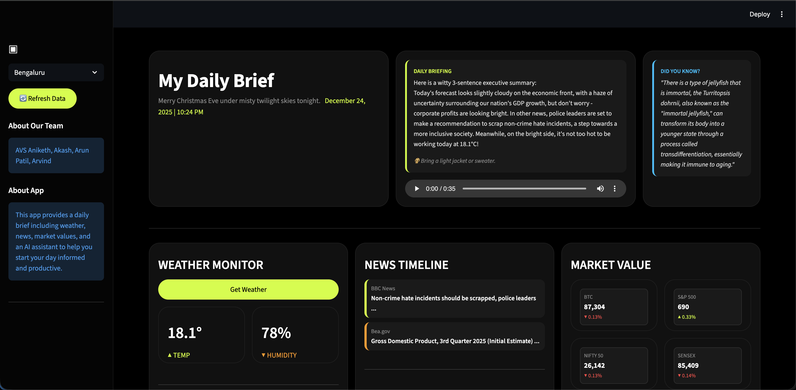

# 🚀 My Daily Brief v2 (Local AI Edition)

 


> **"Your entire day, decoded securely on your machine."**  
> A next-gen personal dashboard that blends **Local AI intelligence**, real-time data, and mindful productivity into a single, breathtaking interface. **100% Privacy. 0% Cloud Cost.**

---

## 📸 Visual Preview


*The Command Center: Weather, News, Finance, and Local AI Insights at a glance.*

---

## 💡 About

**My Daily Brief v2** solves the problem of "tab fatigue" while preserving your privacy. Instead of relying on cloud APIs for intelligence, this version runs entirely on your local hardware using **Ollama**.

It doesn't just show data—it has a personality:
*   **🗣️ Speaks to you**: Listen to your daily briefing while you drink coffee.
*   **🥊 Tough Love**: A built-in "Strict Coach" that yells at you to stop procrastinating.
*   **🌤️ Smart Weather**: Tells you exactly what to wear based on wind/humidity.
*   **🎧 Contextual DJ**: Picks the perfect Spotify playlist based on your workload and weather.

---

## 🛠️ Tech Stack

*   **Core:** Python 3.9+ 🐍
*   **Web Framework:** Streamlit (Custom CSS & Components)
*   **Local AI Inference:** [Ollama](https://ollama.com/) (running `llama3.2:3b`) 🦙
*   **Audio Synthesis:** gTTS (Google Text-to-Speech) 🗣️
*   **Data Visualization:** Plotly & Plotly Express 📊
*   **Financial Data:** yFinance (Yahoo Finance) 📈
*   **APIs:** OpenWeatherMap, NewsAPI, ExchangeRate-API

---

## ✨ v2 Features

### 🧠 Local AI Intelligence
*   **🗣️ Audio Briefing**: Click "Play" to hear your AI assistant read your morning summary.
*   **🥊 Tough Love Mode**: Toggle this in the Focus Zone to switch the AI from "Helpful Assistant" to "Demanding Coach."
*   **🔮 Market Mood Analyst**: Witty, 1-sentence AI logic on why the market is up or down.
*   **🌤️ AI Weather Analyst**: detailed advice on Outfit, Activity, and Health based on live metrics.
*   **💡 Did You Know?**: Generates a fresh, mind-blowing fact every session.

### ⚡ Productivity & Vibe
*   **🎩 Smart Task Breakdown**: Type "Plan a vacation" -> AI generates 5 actionable sub-tasks instantly.
*   **⏱️ AI Task Estimator**: AI analyzes your todo list and predicts how long it will take.
*   **🎧 Contextual DJ**: "Smart Pick" button analyzes the weather + your tasks to queue the right music (Lo-Fi vs Upbeat).
*   **⚡ AI Quick Assist**: A built-in tool to Draft emails, Explain concepts, or Brainstorm ideas.

---

## 📦 Installation

### 1. Prerequisites
*   **Python 3.8+**
*   **[Ollama](https://ollama.com/)** installed and running.

### 2. Setup Local AI
Run this in your terminal to grab the lightweight model:
```bash
ollama pull llama3.2:3b
```

### 3. Clone the Repository
```bash
git clone https://github.com/Annadata-Aniketh/My-Daily-Brief-app-JP-v2.git
cd My-Daily-Brief-app-JP-v2
```

### 4. Install Dependencies
```bash
pip install -r my_daily_brief/requirements.txt
```

### 5. Configure API Keys
Create a `.env` file in the `my_daily_brief` directory (Note: No Gemini Key needed!):

```env
WEATHER_API_KEY=your_openweather_key_here
NEWS_API_KEY=your_newsapi_key_here
```

---

## 🚀 Usage

Run the dashboard locally:

```bash
# On macOS
./run_app_macos.command

# Or manually
streamlit run my_daily_brief/app.py
```

*The app will auto-start the Ollama server if it's not running!*

---

## 🤝 Contributors

| Name | Role |
| :--- | :--- |
| **AVS Aniketh** | Lead Developer |
| **Akash** | Developer |
| **Arun Patil** | Developer |
| **Arvind** | Developer |

---

*Built with ❤️ and Local Compute.*